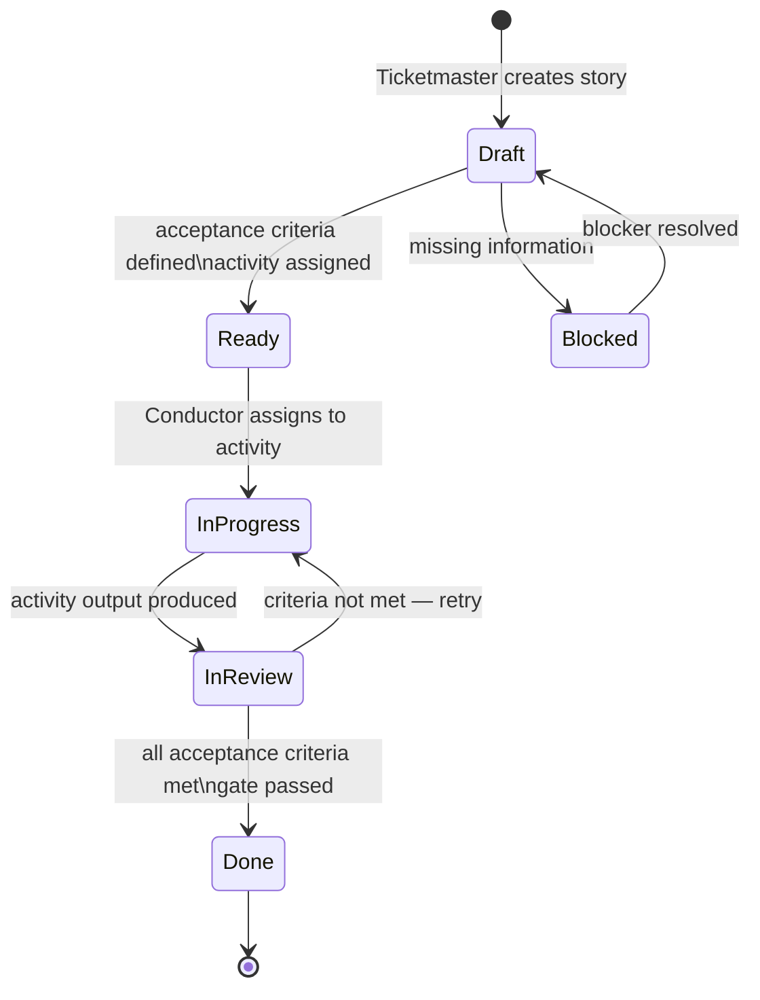

# USER STORIES

Structured requirements for every actor in the system — human or agent.
Stories are the bridge between Epics (what we want) and Activities (what gets built).

**Filled by:** Conductor / Ticketmaster during the Specify activity.
**Read by:** Agents (as context), Conductor (for acceptance gate), Humans (for review).
**Links to:** TESTS.md (acceptance criteria → test cases), RUBRICS.md (criteria → scoring), WORKFLOW.md (activities that implement them).

---

## Story Format

```
ID:     {PROJECT}-{EPIC_ID}-{SEQ}
Epic:   {Epic title}
As a    {role — human or agent}
I want  {one specific capability or outcome}
So that {the value or benefit delivered}

Acceptance criteria:
  - [ ] {observable, testable condition}
  - [ ] {observable, testable condition}

Assigned to activity: {workflow activity name}
Priority: {P0 / P1 / P2}
Status: {draft / ready / in-progress / done / blocked}
```

**Rules:**
- `As a` role must be an explicitly named actor — not "the system" or "it"
- `I want` is one thing. If you write "and", split the story.
- Every acceptance criterion is testable. "Works correctly" is not a criterion.
- Every story maps to exactly one workflow activity.

---

## Roles

Stories can be written for any actor in the system:

| Role | Type | Description |
|---|---|---|
| `human` | Person | End user of the product |
| `admin` | Person | Operator / maintainer |
| `researcher` | Agent | Performs Research activity |
| `chairman` | Agent | Performs Specify activity |
| `architect` | Agent | Performs Design activity |
| `developer` | Agent | Performs Implement activity |
| `tester` | Agent | Performs Validate activity |
| `deployer` | Agent | Performs Deploy activity |
| `monitor` | Agent | Performs Observe activity |
| `conductor` | Orchestrator | Manages all items through all stages |
| `ticketmaster` | Orchestrator | Creates and assigns tickets/stories |

Add project-specific roles as needed.

---

## Stories

### Epic: {Epic Title}

---

#### {PROJECT}-{E}-001

```
As a    {role}
I want  {capability}
So that {value}

Acceptance criteria:
  - [ ] {criterion}
  - [ ] {criterion}

Activity: {activity name}
Priority: P{0/1/2}
Status:   draft
```

---

## Story Status Flow



---

## Traceability Matrix

Every story links forward to tests and backward to epics.
The Conductor uses this to know when an Epic is complete.

| Story ID | Actor | Activity | Test File | Rubric Criterion | Status |
|---|---|---|---|---|---|
| {ID} | {role} | {activity} | `tests/{path}` | {criterion} | {status} |

---

## Agentic Story Patterns

Common patterns for agent stories. Use these as starting points.

**Research agent — context gathering:**
```
As a researcher
I want to receive a complete project brief before starting research
So that I know the scope, constraints, and what to look for
```

**Chairman agent — spec synthesis:**
```
As a chairman
I want all research findings structured as a single brief
So that I can synthesize them into an unambiguous Epic without gaps
```

**Conductor — gate failure:**
```
As the conductor
I want to know the exact failure reason when a gate rejects output
So that I can choose the right mutation strategy for the retry
```

**Conductor — void detection:**
```
As the conductor
I want to detect when an activity has received no input for longer than {timeout}
So that I can investigate the upstream void and alert the human if needed
```

**Developer agent — retry context:**
```
As a developer
I want to receive the tester's critique from the previous attempt
So that I address the specific failures rather than regenerating from scratch
```

**Human — escalation:**
```
As a human
I want to see the full attempt history (scores, models tried, critiques)
when an item is escalated to me
So that I can make an informed decision about threshold adjustment or abort
```

**Tester agent — story mapping:**
```
As a tester
I want to know which Story each failing test maps to
So that my TestReport identifies which acceptance criteria are unmet
```

---

## Notes

- Agent stories define what agents **need**, not what they do. The WORKFLOW.md defines what they do.
- A story written for an agent is a contract: if the system doesn't deliver what the agent needs, the Conductor has a configuration problem to fix, not the agent.
- Stories for the Conductor itself are the most important ones to get right — they define the orchestration logic.
- When in doubt whether something is a story or a task: if it has a role, a want, and a value — it's a story. If it's just a step inside an activity — it's a task in that activity's subprocess.
