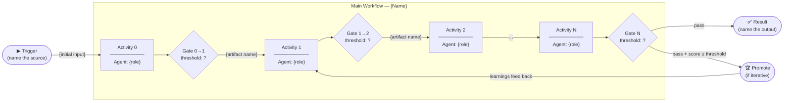
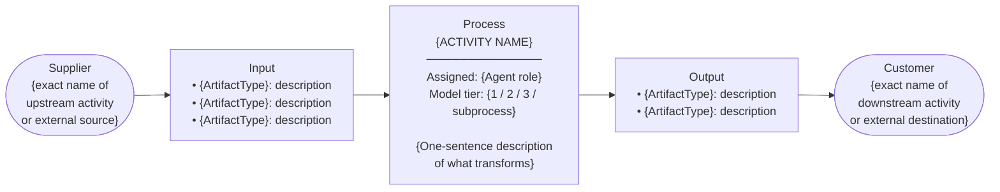
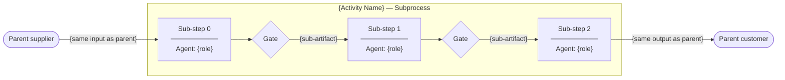
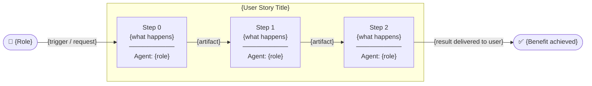
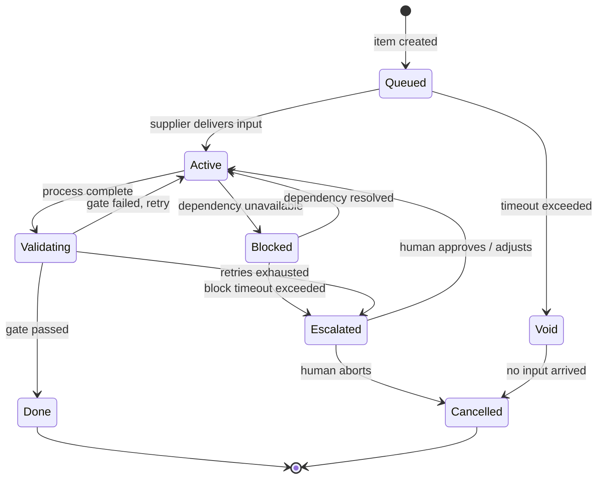
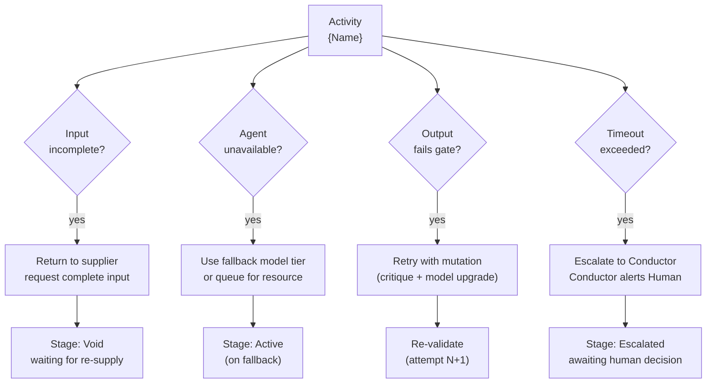
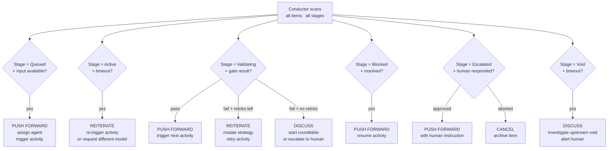

# Workflow Architecture Template

A methodology for documenting autonomous, conductor-managed workflows using SIPOC.
Use this template when designing any multi-stage pipeline — software development, data processing, content creation, service operations, or any process where work flows through defined stages.

---

## Core Principle: SIPOC Discipline

Every activity (node) in a workflow is described as:

| Element | Definition | Rule |
|---|---|---|
| **Supplier** | Who or what provides the input | Must be explicitly named. No "or". No "one of". If there are multiple suppliers, you have a subprocess or a merge node. |
| **Input** | The exact artifact or data received | Must be typed and named. "Information" is not an input. "ResearchBrief.md" is. |
| **Process** | What transformation happens | One verb. One responsibility. If you write "and", split the activity. |
| **Output** | The exact artifact or data produced | Must be typed and named. Must be receivable by the customer. |
| **Customer** | Who or what receives the output | Must be explicitly named. The customer of one activity is the supplier of the next. |

> **The Conductor reads every SIPOC** in the workflow. At any stage it knows:
> what should be happening, who should be doing it, what they need, and what they must produce.
> This is how it decides: push forward, reiterate, or start a discussion.

---

## 1. Main Workflow Definition

Start with the end-to-end pipeline. Name activities as **verbs** (what happens), not agents (who does it).



**Rules:**
- Label every arrow with the artifact it carries
- Every gate has an explicit threshold and max_iterations
- If the pipeline is iterative (output feeds back in), show the feedback arrow explicitly

---

## 2. Activity Specification (One Per Node)

For every activity in the pipeline, fill this template.



**Checklist per activity:**
- [ ] Supplier is a single named source (not "user or system")
- [ ] Every input artifact is typed and named
- [ ] Process has one responsibility (no "and")
- [ ] Output is concrete and receivable (the customer can act on it)
- [ ] Customer is named (not "the next step")
- [ ] Rubrics criteria defined (how is the output scored?)
- [ ] Agent assigned (which role performs this?)
- [ ] Model tier specified (or subprocess command)

---

## 3. Subprocess Drill-Down

When an activity is complex, define it as its own sub-pipeline.
The subprocess SIPOC must match the parent: same input, same output, same supplier, same customer.



**Rule:** A subprocess is a zoom-in. It does not change what the parent workflow sees — same input in, same output out.

---

## 4. User Story as SIPOC Chain

A user story describes a goal from the user's perspective.
Map it to a chain of activities: each step is a SIPOC, each step's output is the next step's input.

**Template:**
> *As a {role}, I want to {goal}, so that {benefit}.*



**For each step in the story, define its SIPOC fully** (see section 2).
This makes edge cases visible: what if the artifact from Step 0 is incomplete? Who detects it? What triggers a retry?

---

## 5. Idle and Void Stages

Every workflow has stages where nothing actively happens — waiting for input, blocked on a dependency, queued for a resource. These are **not failures**. They must be explicitly named and managed.



**Stage definitions:**

| Stage | Meaning | Conductor action |
|---|---|---|
| **Queued** | Waiting for supplier to deliver input | Wait; alert if timeout exceeded |
| **Active** | Agent is performing the activity | Monitor; re-trigger if stuck |
| **Blocked** | Dependency (tool, model, resource) unavailable | Wait; alert human if block persists |
| **Validating** | Gate is scoring the output | Automatic; trigger retry if fail |
| **Escalated** | Retries exhausted; human decision needed | Notify human with full diagnostic |
| **Void** | Input never arrived; activity was never started | Alert; investigate upstream |
| **Done** | Gate passed; output delivered to customer | Trigger next activity |
| **Cancelled** | Human or system aborted | Archive; no further action |

---

## 6. Edge Cases and Error Paths

For each activity, document what can go wrong and how the workflow handles it.



**Template — edge case register per activity:**

| Condition | Detection | Conductor response |
|---|---|---|
| Input missing a required field | Schema validation on receipt | Return to supplier, log void |
| Agent fails to produce valid output | Output schema validation | Retry with critique feedback |
| Gate score below threshold | Rubrics scoring | Retry with mutation strategy |
| Retries exhausted | Attempt counter ≥ max_iterations | Escalate to human |
| Agent/model unavailable | Health check on SPI Manager | Queue; use fallback tier |
| Downstream customer unavailable | Delivery failure | Hold output; retry delivery |
| Activity exceeds time budget | Timeout monitor | Alert Conductor; escalate |

---

## 7. Conductor Integration

The Conductor reads the entire workflow definition and knows every SIPOC.
At each cron tick it evaluates every active item and decides: **push forward, reiterate, or discuss**.



**The Conductor's three decisions:**

| Decision | When | Action |
|---|---|---|
| **Push forward** | Gate passed, next activity ready | Assign agent, deliver input, start activity |
| **Reiterate** | Gate failed, retries available | Mutate strategy, re-run activity with critique |
| **Discuss** | Retries exhausted, void detected, ambiguous input | Start roundtable (Chairman + Researcher) or escalate to human |

---

## 8. Agent Context Specification

Every agent receives a **context packet** when assigned to an activity.
The agent must know its SIPOC exactly — no ambiguity, no choices.

```yaml
# Agent context packet — generated by Conductor per assignment
activity: {activity_name}
agent_role: {role}
model: {resolved_model}          # never "auto" at execution time

sipoc:
  supplier: {exact name}
  input:
    - type: {ArtifactType}
      content: {content or path}
      schema: {schema or null}
  process: >
    {Single clear instruction: what the agent must do,
    what it must NOT do, what constraints apply.}
  output:
    - type: {ArtifactType}
      schema: {required schema}
      destination: {path or next activity}
  customer: {exact name}

rubrics:
  threshold: {float}
  criteria:
    - {criterion}: weight {float}
  current_attempt: {int}
  max_iterations: {int}
  previous_critique: {text or null}   # fed back on retry

context:
  bkc_score: {float or null}
  playbooks: [{strategy text}]
  project_path: {path}
  project_goal: {text}
```

**Rules for agents:**
- The agent's process instruction is unambiguous. It does exactly one thing.
- The agent does not decide what model to use — the Conductor resolved that.
- The agent does not know about other activities — only its own SIPOC.
- On retry, `previous_critique` is always populated. The agent must use it.
- The agent's output must match the declared output schema exactly.

---

## 9. Workflow Document Checklist

Before a workflow is considered defined:

**Main flow:**
- [ ] All activities named as verbs
- [ ] All arrows labeled with artifact names
- [ ] All gates have explicit threshold and max_iterations
- [ ] Feedback loops shown explicitly

**Per activity:**
- [ ] Supplier named exactly (no "or")
- [ ] All inputs typed and named
- [ ] Process is one responsibility
- [ ] All outputs typed and named
- [ ] Customer named exactly
- [ ] Rubrics criteria defined and weighted
- [ ] Agent role assigned
- [ ] Model tier specified

**Subprocesses:**
- [ ] Every complex activity has a subprocess definition
- [ ] Subprocess input/output matches parent SIPOC

**User stories:**
- [ ] Every story mapped to a chain of activities
- [ ] Each step in the chain has its own SIPOC

**Idle and void:**
- [ ] All idle stages named and timeout defined
- [ ] Conductor action defined for each idle stage

**Edge cases:**
- [ ] Edge case register complete for each activity
- [ ] Fallback defined for agent/model unavailability

**Conductor:**
- [ ] Push forward condition defined per activity
- [ ] Reiterate condition defined per activity
- [ ] Discuss/escalate condition defined per activity

**Agents:**
- [ ] Context packet schema defined
- [ ] Output schema defined and enforced
